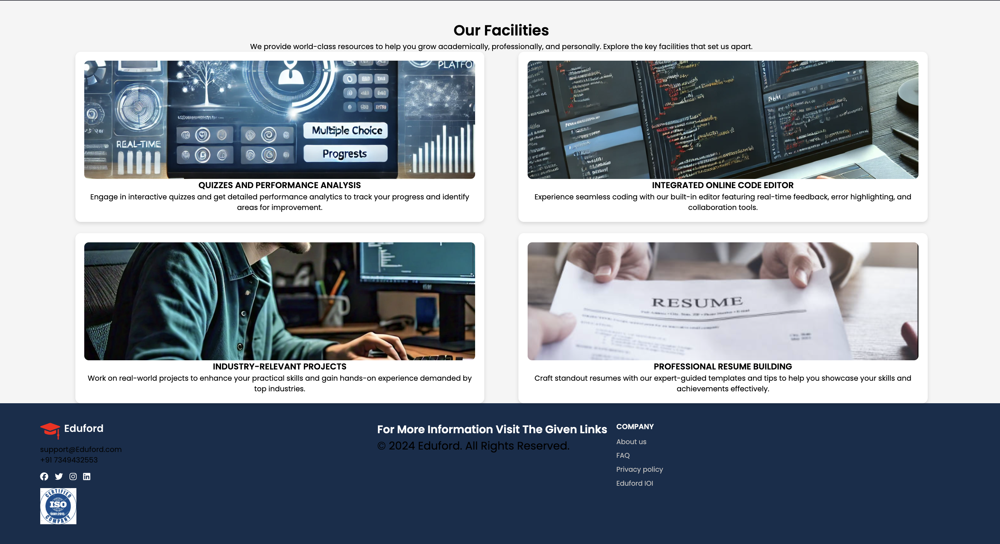

📘 EduFord – Modern Educational Website 
Live at : https://eduford-a-one-stop-solution-for-nuqo.onrender.com

EduFord is a fully responsive and visually engaging educational website built using HTML, CSS, and JavaScript.
It showcases a complete multi-page layout designed for schools, coaching institutes, colleges, or any learning platform.

🚀 Features

🎨 Modern UI/UX with clean sections and smooth visuals

📱 Fully Responsive Design for all devices

📄 Multi-Page Website (Home, About, Courses, Blog, Contact)

🎥 Hero Banner + Image Sections for better presentation

🧭 Sticky Navigation Bar

📰 Blog/News Section

📬 Contact Page with Form

⚡ Structured, clean, and reusable codebase

🖥 Tech Stack
Technology	Purpose
HTML5	Structure of the website
CSS3	Styling & layout, animations
JavaScript	Interactivity and behavior
Google Fonts / Icons	Typography & icons

How to Run the Project

Clone the repository:

git clone https://github.com/<your-username>/EduFord.git

Open the project folder:

cd EduFord

Open index.html in your browser:

Double-click the file
OR

open index.html

📸 Screenshots 
Home:  
 
About:  
 
Courses:  
 
Faculty:
 
Review:
 

